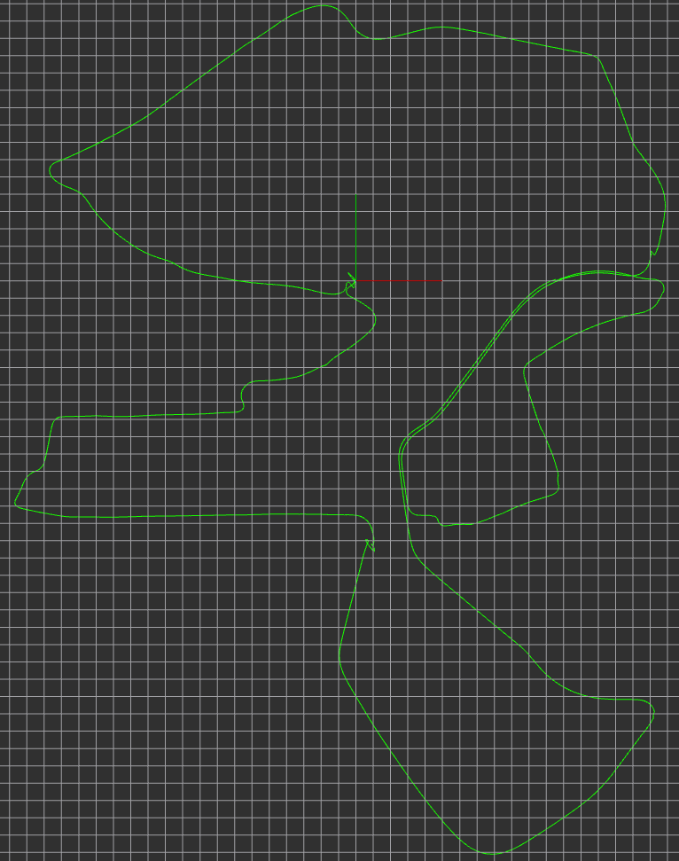

# Imu and Gps Fusion by ESKF
## Explain
- [https://blog.csdn.net/weixin_37835423/article/details/109452148](https://blog.csdn.net/weixin_37835423/article/details/109452148)
- [https://blog.csdn.net/weixin_37835423/article/details/109476346](https://blog.csdn.net/weixin_37835423/article/details/109476346)

## Requirements

- [ROS Kinetic](http://wiki.ros.org/kinetic/Installation/Ubuntu)
- Eigen3

## Reference Theory

- [Quaternion kinematics for error state kalman filter](http://www.iri.upc.edu/people/jsola/JoanSola/objectes/notes/kinematics.pdf)

## Used in

- [wgs_conversions]( https://github.com/gyjun0230/wgs_conversions ) for transform between coordinate in wgs frame and coordinate in enu frame

## Dataset

- https://drive.utbm.fr/s/B9eq899fQ4NdWYn

## Test

```
roslaunch imu_gps_fusion imu_gps_fusion.launch
```

```
rosbag play *.bag --clock
```

## Result


